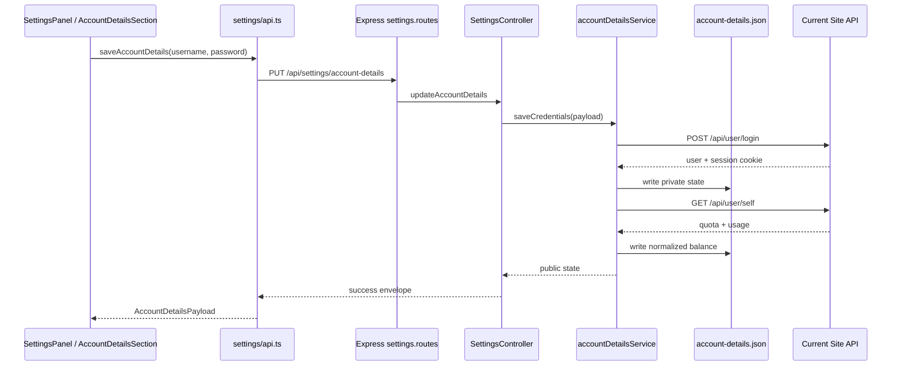

# Account Details Module / 账号明细模块

## Purpose / 目标

账号明细模块用于在设置页中管理站点账号凭据，并展示该账号的余额、用量和调用日志。模块名、前端状态、API client、后端 service 和主存储文件都使用通用的 `accountDetails` / `account-details` 命名，避免把能力限定成某一个站点。

The Account Details module manages site account credentials from the Settings page and displays account balance, usage, and API call logs. Frontend state, API client functions, backend services, and the primary storage file use generic `accountDetails` / `account-details` naming so the feature is not framed as a single-site integration.

当前已接入的实现仍然调用 `https://www.6789api.top` 的登录、自身信息和日志接口。`6789` 只应出现在当前站点适配常量、旧 HTTP 兼容路由、旧存储迁移路径，以及明确测试旧兼容行为的地方。

The current implementation still calls the login, self, and log endpoints at `https://www.6789api.top`. The string `6789` should only appear in the current site adapter constant, legacy HTTP compatibility routes, legacy storage migration path, or tests that explicitly cover compatibility.

## User Experience / 用户体验

设置页左侧导航中显示模块名 `账号明细`，描述为 `账号登录、余额与调用日志`。

The Settings navigation shows the module as `账号明细`, with the description `账号登录、余额与调用日志`.

模块主体由三个区块组成：

- `账号凭据`: 输入用户名和密码，保存并登录，刷新明细，清除账号。
- `账号状态`: 展示配置状态、登录状态、刷新时间、登录用户、余额、总用量和请求次数。
- `调用日志`: 分页展示当前账号的调用记录，包括模型、Token 名称、消耗、输入 tokens、输出 tokens 和内容摘要。

The module body is composed of three sections:

- `Account credentials`: enter username and password, save and log in, refresh details, and clear the account.
- `Account status`: displays configuration state, login state, refresh time, login user, balance, used balance, and request count.
- `Call logs`: paginated account logs with model name, token name, cost, prompt tokens, completion tokens, and content summary.

用户可见文案不应写成 `6789 账号`、`6789 余额` 或 `账号余额`。如果未来接入更多站点，UI 不需要再改模块名。

User-facing copy should not say `6789 account`, `6789 balance`, or `Account Balance` as the module name. If more sites are added later, the module name should remain stable.

## Frontend Chain / 前端链路

### Entry Points / 入口

- Settings shell: `src/features/settings/components/SettingsPanel.tsx`
- Module component: `src/features/settings/components/AccountDetailsSection.tsx`
- Shared action/view types: `src/features/settings/components/shared.ts`
- Settings module id union: `src/features/settings/components/styles.tsx`
- API client: `src/features/settings/api.ts`
- Payload types: `src/features/settings/types.ts`

### State Ownership / 状态归属

`SettingsPanel.tsx` owns all runtime state for this module:

- `accountDetails`
- `accountDetailsUsername`
- `accountDetailsPassword`
- `accountDetailsLoading`
- `accountDetailsSaving`
- `accountDetailsRefreshing`
- `accountDetailsLogs`
- `accountDetailsLogsLoading`
- `accountDetailsLogsPage`

`SettingsPanel.tsx` also owns the async actions and passes them into `AccountDetailsSection` through `SettingsActions`:

- `saveAccountDetails`
- `refreshAccountDetails`
- `refreshAccountDetailsLogs`
- `clearAccountDetails`
- `setAccountDetailsUsername`
- `setAccountDetailsPassword`
- `setAccountDetailsLogsPage`

`AccountDetailsSection.tsx` is intentionally presentational. It formats values, renders the cards, and calls action callbacks. It does not call HTTP APIs directly.

`AccountDetailsSection.tsx` 是纯展示组件：负责格式化和渲染卡片，并通过 action 回调触发行为；它不直接请求 HTTP API。

### Frontend API Client / 前端 API Client

`src/features/settings/api.ts` exposes these functions:

```ts
loadAccountDetails(): Promise<AccountDetailsPayload | null>
saveAccountDetails(username: string, password: string): Promise<AccountDetailsPayload>
refreshAccountDetails(): Promise<AccountDetailsPayload>
clearAccountDetails(): Promise<AccountDetailsPayload>
loadAccountDetailsLogs(page = 1, pageSize = 20): Promise<AccountDetailsLogsPayload>
```

These functions call the generic backend routes:

```text
GET    /api/settings/account-details
PUT    /api/settings/account-details
POST   /api/settings/account-details/refresh
GET    /api/settings/account-details/logs?page=1&pageSize=20
DELETE /api/settings/account-details
```

这些函数只使用通用 `/account-details` 路径。旧 `/6789-account` 路径只留给兼容，不应在新前端代码中继续使用。

These functions use only the generic `/account-details` path. The legacy `/6789-account` path remains for compatibility and should not be used by new frontend code.

## Backend Chain / 后端链路

### Routes / 路由

`backend/src/modules/settings/settings.routes.js` defines the generic routes:

```text
GET    /account-details
PUT    /account-details
POST   /account-details/refresh
GET    /account-details/logs
DELETE /account-details
```

For compatibility, the same controller methods are also mounted under legacy routes:

```text
GET    /6789-account
PUT    /6789-account
POST   /6789-account/refresh
GET    /6789-account/logs
DELETE /6789-account
```

兼容路由不代表模块只支持该站点。它们只是避免旧版本前端或外部调用立即断开。

The compatibility routes do not mean the module is single-site only. They exist to avoid breaking older frontends or external callers.

### Controller / Controller

`backend/src/modules/settings/settings.controller.js` imports `accountDetailsService` and exposes:

- `getAccountDetails`
- `updateAccountDetails`
- `refreshAccountDetails`
- `getAccountDetailsLogs`
- `clearAccountDetails`

Each method wraps the service result with `successEnvelope(...)` and forwards errors to the shared error middleware.

每个方法都把 service 结果包进 `successEnvelope(...)`，并把异常交给统一错误处理中间件。

### Service / Service

`backend/src/modules/settings/account-details.service.js` owns the current site integration and normalization logic.

Core methods:

- `getPublicState()`: returns public account state without password, session, or cookies.
- `saveCredentials(payload)`: validates username/password, logs in, fetches account details, and returns public state.
- `login({ username, password })`: calls the current site login endpoint, extracts session cookie, normalizes user info, and persists private state.
- `refreshBalance(options)`: ensures a valid session, fetches account details, and retries once after relogin when the detail query fails.
- `ensureSession(state)`: reuses a valid session or logs in again when missing/expired.
- `fetchAndStoreBalance(state)`: calls the current site's self endpoint and stores normalized balance data.
- `getLogs(query, options)`: builds a paginated log query, fetches current account logs, normalizes costs/tokens, and retries once after relogin when needed.
- `clear()`: clears stored credentials and session state.

The current site-specific constants are:

```js
const ACCOUNT_DETAILS_BASE_URL = 'https://www.6789api.top';
const LOGIN_PATH = '/api/user/login?turnstile=';
const SELF_PATH = '/api/user/self';
const LOG_SELF_PATH = '/api/log/self';
```

未来接入新站点时，优先把这些站点差异抽成 adapter，而不是把 `accountDetailsService` 再改回某个站点名。

When adding more sites later, prefer extracting these site differences into adapters instead of renaming `accountDetailsService` back to a site-specific service.

## Storage / 存储

`backend/src/platform/storage/storage-paths.js` defines:

```js
accountDetailsFile: path.join(root, 'config', 'account-details.json')
legacyAccountDetailsFile: path.join(root, 'config', 'account-6789.json')
```

`account-details.json` is the primary storage file. `account-6789.json` is only read as a fallback so existing local installations keep working after the rename.

`account-details.json` 是主存储文件。`account-6789.json` 只作为旧版本兼容读取，确保已安装用户升级后仍能恢复原有账号状态。

The stored private state includes:

```ts
{
  username: string;
  password: string;
  session: string;
  sessionExpiresAt: number;
  user: AccountUser | null;
  balance: AccountBalance | null;
  updatedAt: number;
}
```

The public API response intentionally excludes:

- `password`
- `session`
- raw cookies

公开 API 响应不会返回密码、session 或 cookie。

## Data Normalization / 数据标准化

The backend normalizes upstream data before returning it to the frontend.

后端会把上游数据转换成前端稳定可用的结构。

User payload:

```ts
{
  id: number;
  username: string;
  displayName: string;
  role: number;
  status: number;
}
```

Balance payload:

```ts
{
  quota: number;
  usedQuota: number;
  requestCount: number;
  balance: number;
  usedBalance: number;
  refreshedAt: number;
}
```

The current adapter calculates `balance` and `usedBalance` as:

```text
quota / 500000
used_quota / 500000
```

Log payload:

```ts
{
  id: number;
  userId: number;
  createdAt: number;
  type: number;
  content: string;
  tokenName: string;
  modelName: string;
  quota: number;
  cost: number;
  promptTokens: number;
  completionTokens: number;
}
```

The current adapter calculates `cost` as `quota / 500000`.

当前 adapter 将日志 `cost` 计算为 `quota / 500000`。

## End-to-End Flow / 端到端流程



## Error Handling / 错误处理

The service uses structured application errors:

- `ValidationError`: missing credentials or missing configuration.
- `ProviderError`: upstream login/detail/log failures or malformed upstream payloads.

The backend error middleware converts these into unified API error envelopes.

Service 使用结构化错误：

- `ValidationError`: 凭据缺失或尚未配置账号。
- `ProviderError`: 上游登录、明细、日志失败，或上游响应结构不符合预期。

后端统一错误中间件会把这些错误转换成统一 API 错误响应。

## Security Notes / 安全说明

- Passwords and sessions are stored only in the local backend config file.
- Public responses must never expose `password`, `session`, or cookies.
- The frontend password field is cleared after a successful save.
- The UI does not display saved passwords or sessions.
- Requests use `proxyAwareFetch`, so the module respects the app's outbound proxy strategy.
- Session refresh logic retries once after relogin to avoid infinite retry loops.

安全约束：

- 密码和 session 只保存在本机后端配置文件中。
- 公开响应不能暴露 `password`、`session` 或 cookie。
- 保存成功后，前端会清空密码输入框。
- UI 不展示已保存密码或 session。
- 请求通过 `proxyAwareFetch` 发出，因此遵循应用的出站代理策略。
- session 失效后的重新登录只重试一次，避免无限循环。

## Tests / 测试

Relevant tests:

- `backend/tests/account-details.service.test.js`
  - saves credentials while returning only public state
  - refreshes details and converts quota to balance
  - relogs once when detail query fails
  - proxies logs and normalizes costs
  - relogs once when log query fails
- `backend/tests/http-contract.test.js`
  - verifies account detail HTTP responses do not expose secrets
  - verifies pagination caps for logs

Recommended checks after changing this module:

```bash
npm.cmd run typecheck
npm.cmd run test --prefix backend -- account-details.service.test.js http-contract.test.js
npm.cmd run build
```

在 PowerShell 中如果 `npm.ps1` 被执行策略拦截，使用 `npm.cmd`。

If PowerShell blocks `npm.ps1` due to execution policy, use `npm.cmd`.

## Extension Guide / 扩展指南

To add another site:

1. Keep the UI module named `账号明细` / `Account Details`.
2. Keep the frontend route usage on `/api/settings/account-details`.
3. Extract site-specific constants and normalization into an adapter layer.
4. Store a site/provider id in the private state if users need multiple account-detail providers.
5. Keep public payloads stable so `AccountDetailsSection` does not need provider-specific branches.
6. Add tests for the new adapter's login, detail refresh, log normalization, and secret redaction.

新增站点时建议：

1. 保持 UI 模块名为 `账号明细` / `Account Details`。
2. 前端继续请求 `/api/settings/account-details`。
3. 将站点特有的路径、字段转换和余额计算抽成 adapter。
4. 如果需要多账号明细提供方，在私有状态中增加 site/provider id。
5. 保持公开 payload 结构稳定，避免 `AccountDetailsSection` 出现站点分支。
6. 为新 adapter 补充登录、明细刷新、日志标准化和敏感信息不外泄测试。

## Naming Rules / 命名规则

Use generic names for product and code surfaces:

- `账号明细`
- `AccountDetails`
- `accountDetails`
- `account-details`
- `/api/settings/account-details`
- `account-details.json`

Avoid these names in new code or UI:

- `账号余额` as the module name
- `AccountBalanceSection`
- `account_balance`
- `account6789`
- `Account6789`
- `/api/settings/6789-account` for new frontend calls

Exceptions:

- `ACCOUNT_DETAILS_BASE_URL = 'https://www.6789api.top'` while this is the only implemented upstream site.
- Legacy route mounts under `/6789-account`.
- Legacy storage fallback path `account-6789.json`.
- Tests that deliberately cover current upstream compatibility or old-path compatibility.

